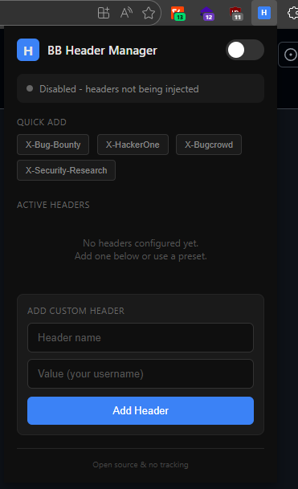

# BB Header Manager

A simple, open-source Chrome extension for bug bounty hunters to inject custom headers into HTTP requests.

## Why?

Most bug bounty programs ask researchers to identify their traffic with a header like `X-Bug-Bounty: username`. This helps security teams distinguish legitimate testing from malicious activity.

Existing extensions have had issues with tracking, affiliate injection, and sketchy ownership changes. This extension does one thing well with zero BS.

## Features

- Add/remove custom HTTP headers
- One-click toggle on/off
- Quick presets for common headers (X-Bug-Bounty, X-HackerOne, X-Bugcrowd, X-Security-Research)
- Headers persist across browser restarts
- Clean dark UI with status indicator
- No tracking, no analytics, no external requests
- Fully open source

## Installation

### Chrome Web Store (Recommended)

[Install from Chrome Web Store]([(https://chromewebstore.google.com/detail/llpjjjjocdmaeknobpfdjojdamaplfii?utm_source=item-share-cb)]) COMING SOON!!! 

### Manual Install

1. Download the latest release or clone this repo
2. Go to `chrome://extensions`
3. Enable "Developer mode" (top right)
4. Click "Load unpacked"
5. Select the extension folder

## Usage

1. Click the extension icon in your toolbar
2. Add a header using the quick presets or enter a custom one
3. Toggle the switch to enable injection
4. All HTTP requests will now include your headers

The badge shows "ON" when headers are being injected.

## Verify It's Working

1. Open DevTools (F12) on any website
2. Go to the Network tab
3. Reload the page
4. Click any request and check Request Headers
5. Your custom headers should be listed

Or use [webhook.site](https://webhook.site) to inspect the exact headers being sent.

## Permissions

| Permission | Why |
|------------|-----|
| `declarativeNetRequest` | Required to modify HTTP request headers (Manifest V3 API) |
| `storage` | Save your header configs locally so they persist |
| `<all_urls>` | Inject headers on any target you're testing |

## Privacy

- Zero data collection
- Zero analytics
- Zero external network requests
- All data stored locally in your browser
- No remote code execution

## License

MIT

## Author
GKData + Claude 
Built by a bug bounty hunter, for bug bounty hunters.
